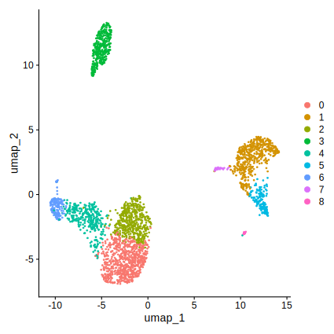
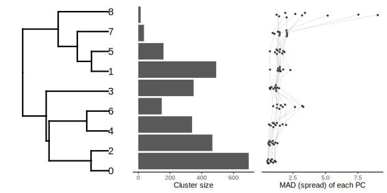

# Dendrogram of single-cells clusters

<!-- vim-markdown-toc GFM -->

* [Setup](#setup)
* [Get example data from Seurat](#get-example-data-from-seurat)
* [Analysis](#analysis)

<!-- vim-markdown-toc -->

To facilitate the interpretation of clusters of single cells, we plot the
clusters on a dendrogram so we can see how far apart clusters are from each
other. This may be an addition to the usual UMAP representation. The dendrogram
is accompanied by a barplot of cluster size (number of cells) and how spread
out a cluster is on each axis (MAD: mean absolute deviation)

Here's a comparison between UMAP and dendrogram using Seurat's example data:




Things I like:

* The distance between clusters, i.e. the branch length, is meaningful (usual big if:
  provided the choice of reduction, distance metrics, etc. is appropriate)

* You can annotate clusters (e.g. with barplots as in here)

* In this example: Cluster 8 is small and spread-out (not easy to see in UMAP),
  cluster 0 is the largest and quite compact (again: not sure if this is a
  consequence of the dimensionality reduction)

# Setup

Use your favourite method to install the [requirements](requirements.txt). Using
mamba:

```
mamba create -n scrnaseq_dendrogram
mamba activate scrnaseq_dendrogram
mamba install --yes --file requirements.txt -n scrnaseq_dendrogram
mkdir -p output
```

# Get example data from Seurat

```
curl -O https://cf.10xgenomics.com/samples/cell/pbmc3k/pbmc3k_filtered_gene_bc_matrices.tar.gz
tar zxvf pbmc3k_filtered_gene_bc_matrices.tar.gz
rm pbmc3k_filtered_gene_bc_matrices.tar.gz
```

# Analysis

This is standard processing from raw data to PCA and UMAP following the Seurat
tutorial.

```
library(data.table)
library(dendextend)
library(Seurat)
library(ggbeeswarm)
library(gridExtra)

cosine.distance <- function(m) {
    # https://stats.stackexchange.com/a/367216/31142
    sim <- m / sqrt(rowSums(m * m))
    sim <- sim %*% t(sim)
    return(as.dist(1 - sim))
}   

## Prepare dataset: Normalization, dimensionality reduction, clustering

pbmc.data <- Read10X(data.dir = "filtered_gene_bc_matrices/hg19/")
pbmc <- CreateSeuratObject(counts = pbmc.data, project = "pbmc3k", min.cells = 3, min.features = 200)
pbmc[["percent.mt"]] <- PercentageFeatureSet(pbmc, pattern = "^MT-")
pbmc <- NormalizeData(pbmc, normalization.method = "LogNormalize", scale.factor = 10000)
pbmc <- FindVariableFeatures(pbmc, selection.method = "vst", nfeatures = 2000)
all.genes <- rownames(pbmc)
pbmc <- ScaleData(pbmc, features = all.genes)
pbmc <- RunPCA(pbmc, features = VariableFeatures(object = pbmc))

ndims <- 10

pbmc <- FindNeighbors(pbmc, dims = 1:ndims)
pbmc <- FindClusters(pbmc, resolution = 0.5)

## Standard UMAP

pbmc <- RunUMAP(pbmc, dims = 1:ndims)
DimPlot(pbmc, reduction='umap')
ggsave('output/umap.svg', width=15, height=15, units='cm')
```

Start here if you already have a matrix of cells (rows) and dimensions
(columns, usually the first principal components) and cells already clustered.

```
## Input matrix:
cell.embed <- pbmc@reductions$pca@cell.embeddings

## Reshape data for dendrogram of clusters

stopifnot(identical(rownames(cell.embed), names(Idents(pbmc))))
cell.embed <- as.data.table(cell.embed)
cell.embed[, cluster := Idents(pbmc)]
cell.embed[, cell_id := names(Idents(pbmc))]
cell.embed <- melt(cell.embed, id.var=c('cluster', 'cell_id'), variable.name='PC', value.name='value')
cell.embed[, PC := as.numeric(sub('PC_', '', PC))]

## Centroid of each cluster and mean absolute deviation (MAD) of each cluster
## in each PC (MAD: roughly a measure of how spread out is a cluster on each
## axis)

centrd <- cell.embed[PC %in% 1:ndims, list(
    centroid=mean(value),
    mad=mean(abs(value - mean(value))),
    .N), by=list(cluster, PC)]
xmad <- copy(centrd)
cstat <- centrd[, list(mad=mean(mad)), by=list(cluster, N)]
centrd <- dcast(data=centrd, cluster ~ PC, value.var='centroid')
centrd <- as.matrix(centrd, rownames='cluster')

## Distance between cluster centroids and dendrogram

dd <- cosine.distance(centrd)
dend <- ladderize(as.dendrogram(hclust(dd)))
cstat[, cluster := factor(cluster, get_leaves_attr(dend, "label"))]
xmad[, cluster := factor(cluster, get_leaves_attr(dend, "label"))]

## Summary plot 

gg1 <- ggplot(dend, horiz=TRUE)
gg2 <- ggplot(data=cstat, aes(x=cluster, y=N)) +
    geom_col() +
    theme_classic() + 
    coord_flip() +
    ylab('Cluster size') +
    theme(axis.title.y=element_blank()) +
    guides(y='none')
gg3 <- ggplot(data=xmad, aes(x=cluster, y=mad, group=PC)) +
    geom_quasirandom(width=0.2, alpha=0.8, stroke=NA) +
    geom_line(colour='grey60', linewidth=0.1) +
    theme_classic() + 
    coord_flip() +
    ylab('MAD (spread) of each PC') +
    theme(axis.title.y=element_blank()) + 
    guides(y='none')

g <- arrangeGrob(gg1, gg2, gg3, nrow=1)
ggsave('output/dendro.svg', g, width=20, height=10, units='cm')
```
